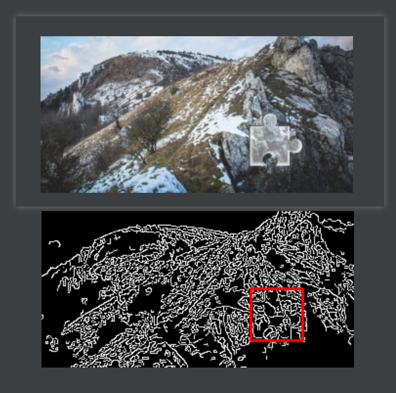

# AyugeSpiderTools 工具说明

> 本文章用于说明在爬虫开发中遇到的各种通用方法，还有 `scrapy` 扩展库开发，将其打包成 `Pypi` 包以方便安装和使用，此工具会长久维护。

## 前言
在 `Python` 开发时会遇到一些经常使用的自封装模块，为了更方便地使用这些模块，我们需要将其打包并发布到 `Pypi` 上。

## 项目状态

> 目前项目正处于**积极开发和维护**中

项目目前暂定主要包含**两大部分**：

- 开发场景中的工具库
  - 比如 `MongoDB`，`Mysql sql` 语句的生成，图像处理，数据处理相关 ... ...
- `Scrapy` 扩展功能（主推功能）
  - 使爬虫开发无须在意数据库和数据表结构，不用去管常规 `item, pipelines` 和 `middlewares` 的文件的编写

注：具体内容请查看本文中的 [TodoList](# TodoList) 内容

## 1. 前提条件

> `python 3.8+` 可以直接输入以下命令：

```shell
pip install ayugespidertools -i https://pypi.org/simple
```

注：本库依赖中的 `pymongo` 版本要在 `3.12.3` 及以下是因为我的 `mongoDB` 的版本为 `3.4`，`pymogo` 官方从 `3.12.3` 以后的版本开始不再支持 `3.6` 版本以下的 `MongoDB` 数据库了，望周知！

### 1.1. 使用方法

#### 1.1.1. Scrapy 扩展库场景

> 此扩展使 `Scrapy` 爬虫开发不用考虑其 `item` 编写，内置通用的 `middlewares` 中间件方法（随机请求头，动态/独享代理等），和常用的 `pipelines` 方法（`Mysql`，`MongoDB` 存储，`Kafka`，`RabbitMQ` 推送队列等）。
>
> 开发人员只需根据命令生成示例模板，再配置并激活相关设置即可，可以专注于爬虫 `spider` 的开发。

使用方法示例 `GIF` 如下： 


对以上 `GIF` 中的步骤进行解释：

```shell
查看库版本
ayugespidertools version

创建项目
ayugespidertools startproject <project_name>

进入项目根目录
cd <project_name>

生成爬虫脚本
ayugespidertools genspider <spider_name> <example.com>

替换(覆盖)为真实的配置 .conf 文件；这里是为了演示方便，正常情况是直接在 VIT 路径下的 .conf 配置文件填上相关配置即可
cp /root/mytemp/.conf DemoSpider/VIT/.conf

运行脚本
scrapy crawl <spider_name>
```

具体使用方法请在 [DemoSpider 之 AyugeSpiderTools 工具应用示例](https://github.com/shengchenyang/DemoSpider) 项目中查看，目前已适配以下场景：

```diff
# 采集数据存入 `Mysql` 的场景：
- 1).demo_one: 配置根据本地 `settings` 的 `LOCAL_MYSQL_CONFIG` 中取值
+ 3).demo_three: 配置根据 `consul` 的应用管理中心中取值
+ 5).demo_five: 异步存入 `Mysql` 的场景

# 采集数据存入 `MongoDB` 的场景：
- 2).demo_two: 采集数据存入 `MongoDB` 的场景（配置根据本地 `settings` 的 `LOCAL_MONGODB_CONFIG` 中取值）
+ 4).demo_four: 采集数据存入 `MongoDB` 的场景（配置根据 `consul` 的应用管理中心中取值）
+ 6).demo_six: 异步存入 `MongoDB` 的场景

# 将 `Scrapy` 的 `Request`，`FormRequest` 替换为其它工具实现的场景
- 以上为使用 scrapy Request 的场景
+ 7).demo_seven: scrapy Request 替换为 requests 请求的场景(一般情况下不推荐使用，同步库会拖慢 scrapy 速度，可用于测试场景)

+ 8).demo_eight: 同时存入 Mysql 和 MongoDB 的场景

- 9).demo_aiohttp_example: scrapy Request 替换为 aiohttp 请求的场景，提供了各种请求场景示例（GET,POST）
+ 10).demo_aiohttp_test: scrapy aiohttp 在具体项目中的使用方法示例

+ 11).demo_proxy_one: 快代理动态隧道代理示例
+ 12).demo_proxy_two: 测试快代理独享代理
```

注：具体内容及时效性请以 [DemoSpider](https://github.com/shengchenyang/DemoSpider) 项目中描述为准。

#### 1.1.2. 开发场景

其开发场景下的功能，请在本文 [2. 功能介绍](# 2. 功能介绍) 部分中查看。

## 2. 功能介绍

### 2.1. 数据格式化

> 目前此场景下的功能较少，后面会慢慢丰富其功能

#### 2.1.1. get_full_url

根据域名 `domain_name` 拼接 `deal_url` 来获得完整链接，示例如下：

```python
full_url = FormatData.get_full_url(
    domain_name="https://static.geetest.com",
    deal_url="/captcha_v3/batch/v3/2021-04-27T15/word/4406ba6e71cd478aa31e0dca37601cd4.jpg")
print(full_url)
```

输出为：

```
https://static.geetest.com/captcha_v3/batch/v3/2021-04-27T15/word/4406ba6e71cd478aa31e0dca37601cd4.jpg
```

#### 2.1.2. click_point_deal

将小数 `decimal` 保留小数点后 `decimal_places` 位，结果四舍五入，示例如下：

```
res = FormatData.click_point_deal(13.32596516, 3)
```

输出为：

```
13.326
```

#### 2.1.3. normal_to_stamp

将网页中显示的正常时间转为时间戳

```python
normal_stamp = FormatData.normal_to_stamp("Fri, 22 Jul 2022 01:43:06 +0800")
print("normal_stamp1:", normal_stamp)

normal_stamp = FormatData.normal_to_stamp("Thu Jul 22 17:59:44 2022")
print("normal_stamp2:", normal_stamp)

normal_stamp = FormatData.normal_to_stamp("2022-06-21 16:40:00")

normal_stamp = FormatData.normal_to_stamp("2022/06/21 16:40:00")
print("normal_stamp4:", normal_stamp)

normal_stamp = FormatData.normal_to_stamp("2022/06/21", date_is_full=False)
print("normal_stamp4_2:", normal_stamp)

# 当是英文的其他格式，或者混合格式时，需要自己自定时间格式化符
normal_stamp = FormatData.normal_to_stamp(
    normal_time="2022/Dec/21 16:40:00",
    _format_t="%Y/%b/%d %H:%M:%S")
print("normal_stamp5:", normal_stamp)
```

输出为：

```
normal_stamp1: 1658425386
normal_stamp2: 1658483984
normal_stamp3: 1655800800
normal_stamp4: 1655800800
normal_stamp4_2: 1655740800
normal_stamp5: 1671612000
```

### 2.2. 图片相关操作

#### 2.2.1. 滑块验证码缺口距离识别

通过背景图片和缺口图片识别出滑块距离，示例如下：

```python
# 参数为图片全路径的情况
gap_distance = Picture.identify_gap("doc/image/2.jpg", "doc/image/1.png")
print("滑块验证码的缺口距离1为：", gap_distance)
assert gap_distance in list(range(205, 218))

# 参数为图片 bytes 的情况
with open("doc/image/1.png", "rb") as f:
    target_bytes = f.read()
with open("doc/image/2.jpg", "rb") as f:
    template_bytes = f.read()
gap_distance = Picture.identify_gap(template_bytes, target_bytes, "doc/image/33.png")
print("滑块验证码的缺口距离2为：", gap_distance)
```

结果为：

| 识别结果展示                                                 | 备注                                                   |
| :----------------------------------------------------------- | ------------------------------------------------------ |
|  | 无                                                     |
|  | 可以展示只识别滑块小方块的结果，得到更精准的坐标数据。 |

#### 2.2.2. 滑块验证轨迹生成

根据滑块缺口的距离生成轨迹数组，目前也不是通用版。

```python
tracks = VerificationCode.get_normal_track(space=120)
```

结果为：

```
生成的轨迹为： [[2, 2, 401], [4, 4, 501], [8, 6, 603], [13, 7, 701], [19, 7, 801], [25, 7, 901], [32, 10, 1001], [40, 12, 1101], [48, 14, 1201], [56, 15, 1301], [65, 18, 1401], [74, 19, 1501], [82, 21, 1601], [90, 21, 1701], [98, 22, 1801], [105, 23, 1901], [111, 25, 2001], [117, 26, 2101], [122, 28, 2201], [126, 30, 2301], [128, 27, 2401], [130, 27, 2502], [131, 30, 2601], [131, 28, 2701], [120, 30, 2802]]
```

### 2.3. Mysql 相关

`sql` 语句简单场景生成，目前是残废版，只适用于简单场景。

更多复杂的场景请查看 [directsql](https://pypi.org/project/directsql/#history), [python-sql](https://pypi.org/project/python-sql/#history),  [pypika](https://pypi.org/project/PyPika/#description) 或 [pymilk](https://pypi.org/project/pymilk/) 的第三方库实现，以后会升级本库的方法。

```python
# mysql 连接
from ayugespidertools import MysqlClient
from ayugespidertools.common.SqlFormat import AboutSql


mysql_client = MysqlClient.MysqlOrm(NormalConfig.PYMYSQL_CONFIG)

# test_select_data
select_sql, select_value = AboutSql.select_generate(
    db_table="zhihu_answer_info",
    key=["id", "q_title"],
    rule={"q_id|=": "34987206"},
    limit=1)
print(f"select_sql: {select_sql}, select_value: {select_value}")
mysql_client.search_data(select_sql, select_value, type="one")

# test_insert_data
insert_sql, insert_value = AboutSql.insert_generate(
    db_table="user",
    data={"name": "zhangsan", "age": 18})
print(f"insert_sql: {insert_sql}, insert_value: {insert_value}")
mysql_client.insert_data(insert_sql, insert_value)

# test_update_data
update_sql, update_value = AboutSql.update_generate(
    db_table="user",
    data={"score": 4},
    rule={"name": "zhangsan"})
print(f"update_sql: {update_sql}, update_value: {update_value}")
mysql_client.update_data(update_sql, update_value)
```

结果为：
```
select_sql: select `id`, `q_title` from `zhihu_answer_info` where `q_id`=%s limit 1, select_value: ('34987206',)
insert_sql: insert into `user` (`name`, `age`) values (%s, %s), insert_value: ('zhangsan', 18)
update_sql: update `user` set `score`=%s where `name`=%s, update_value: (4, 'zhangsan')
```

### 2.4. 自动化相关

目前是残废阶段，以后放上一些自动化相关操作

### 2.5. 执行 js 相关

鸡肋封装，以后会优化和添加多个常用功能。**推荐  [`PyMiniRacer`](https://github.com/sqreen/PyMiniRacer) 或 `D8` 运行 `js`，会少很多坑！**

```python
# 测试运行 js 文件中的方法
js_res = RunJs.exec_js("doc/js/add.js", "add", 1, 2)
print("test_exec_js:", js_res)
assert js_res

# 测试运行 ctx 句柄中的方法
with open('doc/js/add.js', 'r', encoding='utf-8') as f:
    js_content = f.read()
ctx = execjs.compile(js_content)

js_res = RunJs.exec_js(ctx, "add", 1, 2)
print("test_exec_js_by_file:", js_res)
assert js_res
```

## 3. 总结

项目目前是疯狂开发阶段，会慢慢丰富 `python` 开发中的遇到的通用方法。

## TodoList

- [x] `scrapy` 的扩展功能场景
  - [ ] `scrapy` 结合 `crawlab` 的日志统计功能
  - [x] `scrapy` 脚本运行信息统计和项目依赖表采集量统计，可用于日志记录和预警
  - [x] 自定义模板，在 `ayugespidertools startproject <projname>` 和 `ayugespidertools genspider <spidername>` 时生成适合本库的模板文件
  - [x] ~~增加根据 `nacos` 来获取配置的功能~~ -> 改为增加根据 `consul` 来获取配置的功能
  - [x] 代理中间件（独享代理、动态隧道代理）
  - [x] 随机请求头 `UA` 中间件，根据 `fake_useragent` 中的权重来随机
  - [x] 使用以下工具来替换 `scrapy` 的 `Request` 来发送请求
    - [ ] `selenum`: 性能没有 `pyppeteer` 强
    - [x] `pyppeteer`: `Gerapy-pyppeteer` 库已经实现此功能
    - [x] `requests`: 这个不推荐使用，`requests` 同步库会降低 `scrapy` 运行效率
    - [ ] `splash`: 继承 `splash` 渲染 `js` 的功能
    - [x] `aiohttp`: 集成将 `scrapy Request` 替换为 `aiohttp` 的协程方式
  - [x] `Mysql` 存储的场景下适配
    - [x] 自动创建 `Mysql` 用户场景下需要的数据库和数据表及字段格式，还有字段注释
  - [x] `MongoDB` 存储的场景下适配，编写风格与 `Mysql` 存储等场景下一致
  - [ ] 集成 `Kafka`，`RabbitMQ` 等数据推送功能
  - [ ] ... ...
- [x] 常用开发场景
  - [x] `sql` 语句拼接，只是简单场景，后续优化。已给出优化方向，参考库等信息。
  - [x] `mongoDB` 语句拼接
  - [x] 数据格式化处理，比如：去除网页标签，去除无效空格等
  - [ ] 字体反爬还原方法
  - [x] `html` 格式转 `markdown` 格式
  - [x] `html` 数据处理，去除标签，不可见字符，特殊字符改成正常显示等等等
  - [x] 添加常用的图片验证码中的处理方法
    - [x] 滑块缺口距离的识别方法（多种实现方式）
    - [x] 根据滑块距离生成轨迹数组的方法
    - [x] 识别点选验证码位置及点击顺序，识别结果不太好，待优化
    - [ ] 图片乱序混淆的还原方法
  - [ ] ... ...
